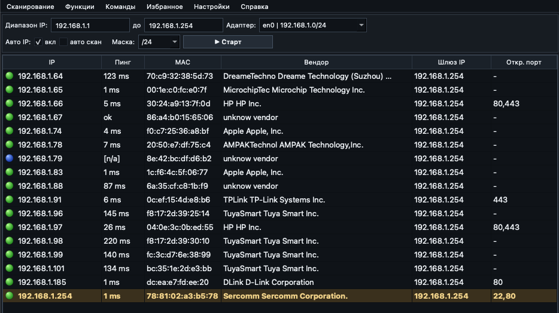

# Universal Network Tools

 
 

## Install from Terminal

<code>curl -L "https://github.com/DeziXsteroid/Universal_Network_Tools/releases/latest/download/Network-Tools-macos-apple-silicon.dmg" -o "Network-Tools-macos-apple-silicon.dmg"</code> 
<code>hdiutil attach "Network-Tools-macos-apple-silicon.dmg"</code> 
<code>cp -R "/Volumes/Network Tools/Network Tools.app" "/Applications/Network Tools.app"</code>

## About

Professional desktop utility for network discovery, device inspection, transport testing, and remote session work. 
The application is focused on fast scanning, compact control panels, stable native behavior, and a clean production-style interface.

## What It Does

Fast IP scanning with MAC, vendor, gateway, and open port detection. 
SSH and Telnet sessions with saved profiles and interactive terminal input. 
HTTP request testing for service diagnostics and API checks. 
Serial, TCP, and UDP communication with text and HEX exchange modes. 
Saved transport presets, interface settings, and scan behavior controls.

